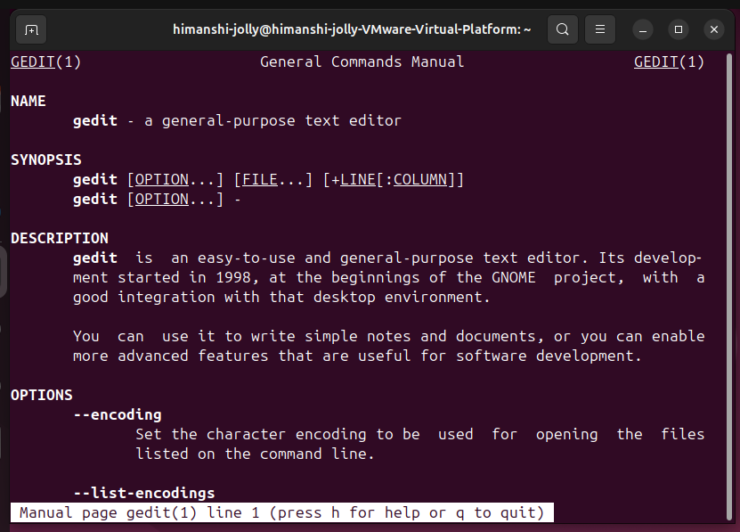
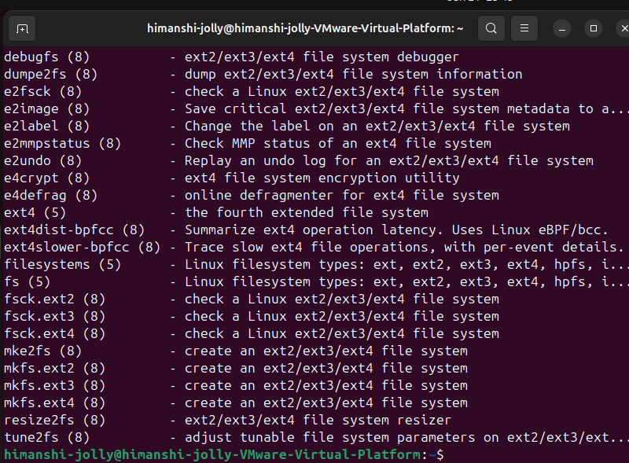
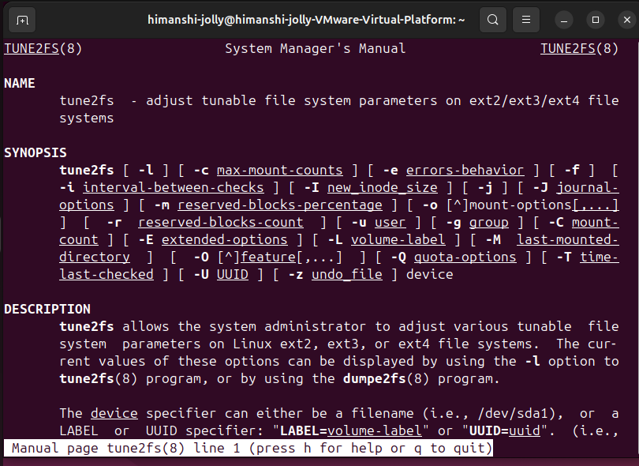
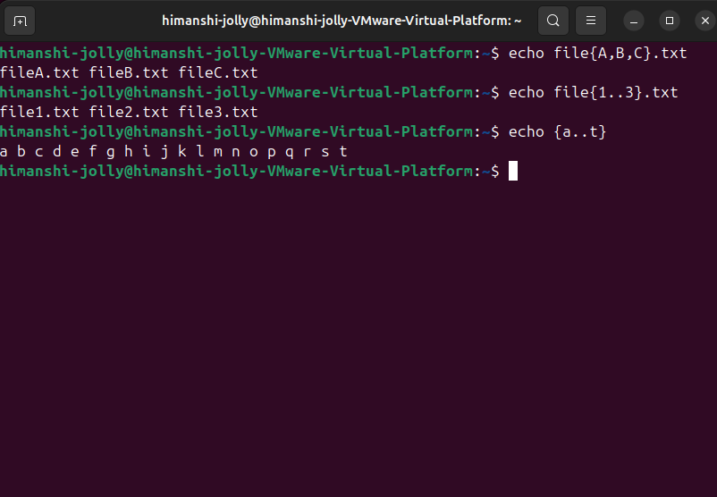

Lab Number: {3-4}
Problem:
1*View the gedit man page. 
2*Use the man -k ext4 command to find the command to tune ext4 file-system parameters. 
3*Brace expansion is used to generate discretionary strings of characters. Braces contain a comma-separated list of strings, or a sequence expression. The result includes the text that precedes or follows the brace definition.

Solution:
1.view the gedit man page.

2.man -k ext4 

man tune2fs

3.Brace expansion.

